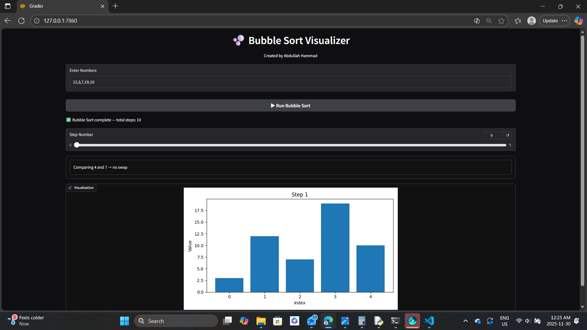

# Bubble Sort Algorithm — Interactive Python App

## Demo Screenshot


---

# Project Overview
This project is an **interactive Bubble Sort visualizer** built using Python and Gradio.  
The app allows users to enter a list of numbers and watch the Bubble Sort algorithm run step-by-step through:

- Animated bar graph updates  
- Text explanations for each comparison and swap  
- A summary showing the total number of steps  

This makes the algorithm easy to understand for beginners.

---

# Problem Breakdown & Computational Thinking

### **Algorithm Chosen**
**Bubble Sort** — a simple comparison-based sorting algorithm that repeatedly swaps adjacent elements if they are in the wrong order.

---

## Computational Thinking Breakdown

### **Decomposition**
- Take an unsorted list of numbers  
- Compare each pair of adjacent elements  
- Swap if needed  
- Repeat until fully sorted  

### **Pattern Recognition**
- The largest element “bubbles” to the end after each pass  

### **Abstraction**
- Only the order and value of the numbers are important  

### **Algorithm Design**
1. **Input:** List of numbers entered by the user  
2. **Process:** Perform Bubble Sort while recording each step  
3. **Output:**  
   - Step-by-step bar graph visualization  
   - Explanation text for each action  
   - Total step summary  

---

#  Features
- Accepts any list of numbers  
- Visual bubble sort animation  
- Text explanations for each swap/comparison  
- Easy-to-use web interface with Gradio  
- Shows total operations performed  

---

# Testing & Verification

I tested the application with several inputs to confirm that the code/app works for all cases :

### **1. Already Sorted Input**  
Input: `1 2 3 4 5`  
- No swaps performed  
- Visualization and summary correct  

### **2. Reverse Sorted Input**  
Input: `5 4 3 2 1`  
- Maximum swaps  
- Final sorted list correct  

### **3. Random Input**  
Input: `7 1 4 2`  
- Correct step-by-step animation  
- Accurate final result  

### **4. Duplicate Values**  
Input: `4 2 4 1`  
- Handled duplicates correctly  

### **5. Unknown Values**  
Input: `hA5 ! ? # 9.207`  
- Shows error and suggests user to use values like `6 1 4 8 2`


The app is fully verified and produces correct results for all tested cases.

---

# How to Use the App
1. Enter a list of numbers (example: `5, 2, 8, 3, 1`)  
2. Click Run Bubble Sort  
3. Watch the animated bar graph  
4. Read the explanation text beneath the visualization  
5. View summary information at the end  

---

# ▶ Steps to Run the Application Locally

1. Open your terminal or command prompt  
2. Navigate to the folder containing `app.py`  
3. Install dependencies:

```bash
pip install -r requirements.txt
```

4. Run the app:

```bash
python app.py
```

---

#  Hugging Face App Link  
https://huggingface.co/spaces/abdullahh19/bubble-sort-visualizer/tree/main

---

# GitHub Repository Link  
https://github.com/hammad19abdullah-cmd/bubble-sort-visualizer.git


---

# Author  
**Abdullah Hammad**  

CISC-121 - Sorting Algorithm Interactive App

